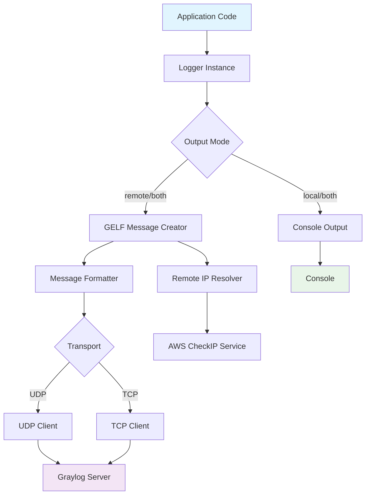
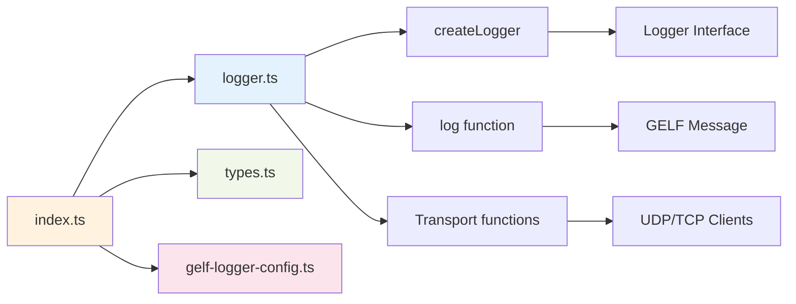
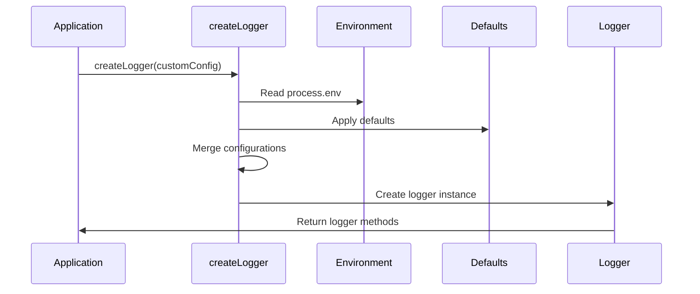
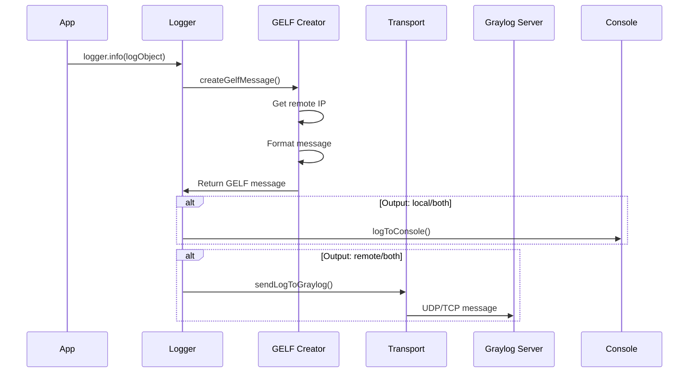

# GELF Simple JS Logger - Documentation

## Overview

**gelf-simple-js-logger** is a lightweight, TypeScript-based logging library that sends structured logs to Graylog using the GELF (Graylog Extended Log Format) protocol. It supports both UDP and TCP transports, local console logging, and flexible configuration options.

### Key Features

- 🚀 **Dual Output**: Send logs to Graylog and/or console
- 🔧 **Multiple Transports**: UDP and TCP support for Graylog
- 📊 **GELF Protocol**: Full GELF 1.1 compliance
- 🎯 **TypeScript Support**: Full type safety and IntelliSense
- ⚡ **Zero Dependencies**: Minimal production dependencies (only axios)
- 🌐 **Auto IP Detection**: Automatic public IP resolution
- 🔍 **Custom Fields**: Add arbitrary fields to log entries

---

## Quick Start Tutorial

### Step 1: Installation

```bash
npm install gelf-simple-js-logger
```

### Step 2: Basic Configuration

Create a configuration file or set environment variables:

**Option A: Configuration File (`logger-config.js`)**
```javascript
module.exports = {
    GRAYLOG_HOST: '127.0.0.1',
    GRAYLOG_TRANSPORT: 'udp',
    GRAYLOG_PORT: 12201,
    GRAYLOG_APPLICATION_NAME: 'my_app',
    GRAYLOG_ENVIRONMENT: 'development',
    GRAYLOG_MIN_LEVEL_LOCAL: 'debug',
    GRAYLOG_MIN_LEVEL_REMOTE: 'info',
    GRAYLOG_OUTPUT: 'both'
};
```

**Option B: Environment Variables**
```bash
export GRAYLOG_HOST=127.0.0.1
export GRAYLOG_TRANSPORT=udp
export GRAYLOG_PORT=12201
export GRAYLOG_APPLICATION_NAME=my_app
export GRAYLOG_ENVIRONMENT=production
export GRAYLOG_OUTPUT=both
```

### Step 3: Basic Usage

```javascript
const { createLogger } = require('gelf-simple-js-logger');

// Initialize logger
const logger = createLogger();

// Send logs
logger.info({ message: 'Application started successfully' });
logger.error({ message: 'Database connection failed', error: 'Connection timeout' });
logger.debug({ 
    message: 'User authentication', 
    userId: 12345, 
    action: 'login',
    ip: '192.168.1.100'
});
```

### Step 4: TypeScript Usage

```typescript
import { createLogger, LogObject } from 'gelf-simple-js-logger';

const logger = createLogger({
    GRAYLOG_HOST: 'graylog.company.com',
    GRAYLOG_APPLICATION_NAME: 'user-service',
    GRAYLOG_ENVIRONMENT: 'production'
});

const logData: LogObject = {
    message: 'User operation completed',
    userId: 12345,
    operation: 'profile_update',
    duration: 250
};

await logger.info(logData);
```

---

## How-To Guides

### How to Configure Different Transport Methods

#### UDP Transport (Default)
```javascript
const logger = createLogger({
    GRAYLOG_TRANSPORT: 'udp',
    GRAYLOG_PORT: 12201
});
```

#### TCP Transport
```javascript
const logger = createLogger({
    GRAYLOG_TRANSPORT: 'tcp',
    GRAYLOG_PORT: 12201
});
```

### How to Control Output Destinations

#### Console Only
```javascript
const logger = createLogger({
    GRAYLOG_OUTPUT: 'local'
});
```

#### Graylog Only
```javascript
const logger = createLogger({
    GRAYLOG_OUTPUT: 'remote'
});
```

#### Both Console and Graylog
```javascript
const logger = createLogger({
    GRAYLOG_OUTPUT: 'both'
});
```

### How to Add Custom Fields

```javascript
logger.info({
    message: 'Payment processed',
    // Custom fields
    paymentId: 'pay_123456',
    amount: 99.99,
    currency: 'USD',
    userId: 12345,
    merchant: 'online-store',
    metadata: {
        campaign: 'summer-sale',
        source: 'mobile-app'
    }
});
```

### How to Handle Different Log Levels

```javascript
const logger = createLogger({
    GRAYLOG_MIN_LEVEL_LOCAL: 'info',   // Only info+ to console
    GRAYLOG_MIN_LEVEL_REMOTE: 'warn'   // Only warn+ to Graylog
});

logger.debug({ message: 'Debug info' });        // Neither
logger.info({ message: 'Info message' });       // Console only
logger.warn({ message: 'Warning message' });    // Both
logger.error({ message: 'Error occurred' });    // Both
logger.critical({ message: 'Critical issue' }); // Both
```

### How to Use in Production with Docker

**Dockerfile**
```dockerfile
FROM node:18-alpine
WORKDIR /app

COPY package*.json ./
RUN npm ci --only=production

COPY . .
RUN npm run build

ENV GRAYLOG_HOST=graylog
ENV GRAYLOG_TRANSPORT=udp
ENV GRAYLOG_PORT=12201
ENV GRAYLOG_APPLICATION_NAME=my-service
ENV GRAYLOG_ENVIRONMENT=production
ENV GRAYLOG_OUTPUT=both

CMD ["node", "--expose-gc", "dist/index.js"]
```

**docker-compose.yml**
```yaml
version: '3.8'
services:
  app:
    build: .
    environment:
      - GRAYLOG_HOST=graylog
      - GRAYLOG_APPLICATION_NAME=my-service
      - GRAYLOG_ENVIRONMENT=production
    depends_on:
      - graylog

  graylog:
    image: graylog/graylog:4.3
    ports:
      - "12201:12201/udp"
      - "9000:9000"
    # ... other graylog configuration
```

---

## API Reference

### Types

#### `LogLevel`
```typescript
type LogLevel = 'debug' | 'info' | 'warn' | 'error' | 'critical';
```

#### `Transport`
```typescript
type Transport = 'udp' | 'tcp';
```

#### `OutputMode`
```typescript
type OutputMode = 'local' | 'remote' | 'both';
```

#### `LoggerConfig`
```typescript
interface LoggerConfig {
  GRAYLOG_HOST: string;              // Graylog server hostname/IP
  GRAYLOG_TRANSPORT: Transport;      // Transport protocol
  GRAYLOG_PORT: number;             // Graylog port
  GRAYLOG_APPLICATION_NAME: string;  // Application identifier
  GRAYLOG_ENVIRONMENT: string;       // Environment (dev, prod, etc.)
  GRAYLOG_MIN_LEVEL_LOCAL: LogLevel; // Min level for console
  GRAYLOG_MIN_LEVEL_REMOTE: LogLevel;// Min level for Graylog
  GRAYLOG_OUTPUT: OutputMode;        // Output destination
}
```

#### `LogObject`
```typescript
interface LogObject {
  message?: string;           // Short message
  full_message?: string;      // Detailed message
  [key: string]: any;        // Custom fields
}
```

#### `Logger`
```typescript
interface Logger {
  debug: (logObject: LogObject) => Promise<void>;
  info: (logObject: LogObject) => Promise<void>;
  warn: (logObject: LogObject) => Promise<void>;
  error: (logObject: LogObject) => Promise<void>;
  critical: (logObject: LogObject) => Promise<void>;
}
```

### Functions

#### `createLogger(customConfig?: Partial<LoggerConfig>): Logger`

Creates a new logger instance with the provided configuration.

**Parameters:**
- `customConfig` (optional): Partial configuration object that overrides defaults

**Returns:** Logger instance with log level methods

**Example:**
```typescript
const logger = createLogger({
    GRAYLOG_HOST: 'logs.company.com',
    GRAYLOG_APPLICATION_NAME: 'api-server'
});
```

#### `getRemoteAddress(): Promise<string>`

Fetches the public IP address using AWS's checkip service.

**Returns:** Promise resolving to IP address string or '0.0.0.0' on error

#### `mapLogLevel(level: LogLevel): number`

Maps string log levels to GELF numeric levels.

**Parameters:**
- `level`: Log level string

**Returns:** Numeric GELF level

**Mapping:**
- `debug` → 7
- `info` → 6  
- `warn` → 4
- `error` → 3
- `critical` → 2

#### `createGelfMessage(level: LogLevel, logObject: LogObject, config: LoggerConfig): Promise<GelfMessage>`

Creates a GELF-compliant message object.

**Parameters:**
- `level`: Log level
- `logObject`: Log data
- `config`: Logger configuration

**Returns:** Promise resolving to formatted GELF message

### Default GELF Fields

Every log message automatically includes:

| Field | Description | Source |
|-------|-------------|---------|
| `version` | GELF version | Fixed: "1.1" |
| `host` | Hostname | `os.hostname()` |
| `short_message` | Brief message | `message` field or "No message" |
| `full_message` | Detailed message | `full_message` or `message` field |
| `level` | Numeric log level | Mapped from log level |
| `application_name` | App identifier | Configuration |
| `environment` | Environment name | Configuration |
| `remote_addr` | Public IP | AWS checkip service |
| `timestamp` | ISO timestamp | `new Date().toISOString()` |

---

## Architecture & Design

### System Architecture



### Component Architecture



### Configuration Flow



### Log Processing Flow



### Performance Considerations

#### Memory Management
- Garbage collection is manually triggered when available (`global.gc`)
- UDP sockets are closed immediately after sending
- TCP connections are properly cleaned up

#### Async Operations
- All logging operations are asynchronous
- IP resolution is cached per message creation
- Non-blocking I/O for network operations

#### Error Handling
- Network errors don't crash the application
- Fallback to default IP (0.0.0.0) if IP resolution fails
- Transport errors are logged to console

### Security Considerations

#### Data Privacy
- Custom fields can contain sensitive data - sanitize before logging
- IP address is automatically collected and sent to Graylog

#### Network Security
- Supports both UDP (faster, less reliable) and TCP (slower, more reliable)
- No built-in encryption - use network-level security (VPN, TLS proxies)

#### Configuration Security
- Environment variables preferred over configuration files
- No credentials stored in the logger itself

---

## Configuration Reference

### Environment Variables

| Variable | Type | Default | Description |
|----------|------|---------|-------------|
| `GRAYLOG_HOST` | string | `127.0.0.1` | Graylog server address |
| `GRAYLOG_TRANSPORT` | `udp\|tcp` | `udp` | Transport protocol |
| `GRAYLOG_PORT` | number | `12201` | Graylog port |
| `GRAYLOG_APPLICATION_NAME` | string | `my-application` | App identifier |
| `GRAYLOG_ENVIRONMENT` | string | `development` | Environment name |
| `GRAYLOG_MIN_LEVEL_LOCAL` | LogLevel | `debug` | Min level for console |
| `GRAYLOG_MIN_LEVEL_REMOTE` | LogLevel | `info` | Min level for Graylog |
| `GRAYLOG_OUTPUT` | OutputMode | `both` | Output destination |

### Configuration Precedence

1. **Custom config object** (highest priority)
2. **Environment variables**
3. **Default values** (lowest priority)

### Example Configurations

#### Development Environment
```javascript
const devConfig = {
    GRAYLOG_HOST: 'localhost',
    GRAYLOG_TRANSPORT: 'udp',
    GRAYLOG_ENVIRONMENT: 'development',
    GRAYLOG_MIN_LEVEL_LOCAL: 'debug',
    GRAYLOG_MIN_LEVEL_REMOTE: 'info',
    GRAYLOG_OUTPUT: 'both'
};
```

#### Production Environment
```javascript
const prodConfig = {
    GRAYLOG_HOST: 'logs.company.com',
    GRAYLOG_TRANSPORT: 'tcp',
    GRAYLOG_ENVIRONMENT: 'production',
    GRAYLOG_MIN_LEVEL_LOCAL: 'warn',
    GRAYLOG_MIN_LEVEL_REMOTE: 'info',
    GRAYLOG_OUTPUT: 'both'
};
```

#### Testing Environment
```javascript
const testConfig = {
    GRAYLOG_OUTPUT: 'local',  // Console only during tests
    GRAYLOG_MIN_LEVEL_LOCAL: 'error'
};
```

---

## Troubleshooting

### Common Issues

#### Logs Not Appearing in Graylog

**Check Configuration:**
```javascript
// Verify Graylog connection
const logger = createLogger({
    GRAYLOG_HOST: 'your-graylog-host',
    GRAYLOG_PORT: 12201,
    GRAYLOG_OUTPUT: 'both'  // Ensure remote output is enabled
});
```

**Test Connectivity:**
```bash
# Test UDP connectivity
nc -u your-graylog-host 12201

# Test TCP connectivity  
nc your-graylog-host 12201
```

#### TypeScript Type Errors

```typescript
// Ensure proper imports
import { createLogger, LogObject, LoggerConfig } from 'gelf-simple-js-logger';

// Use proper types
const config: Partial<LoggerConfig> = {
    GRAYLOG_HOST: 'localhost'
};

const logData: LogObject = {
    message: 'Test message'
};
```

#### Performance Issues

**Memory Leaks:**
```javascript
// Run with garbage collection enabled
node --expose-gc your-app.js
```

**High Network Usage:**
```javascript
// Use TCP for reliability, UDP for performance
const logger = createLogger({
    GRAYLOG_TRANSPORT: 'udp',  // Faster but less reliable
    GRAYLOG_OUTPUT: 'remote'   // Skip console logging
});
```

### Debug Mode

```javascript
const logger = createLogger({
    GRAYLOG_OUTPUT: 'local',           // Console only
    GRAYLOG_MIN_LEVEL_LOCAL: 'debug'   // All levels
});

logger.debug({ message: 'Debug configuration test' });
```

### Network Diagnostics

```bash
# Check if Graylog is receiving logs
sudo tcpdump -i any port 12201

# Monitor application logs
tail -f /var/log/your-app.log
```

---

## Examples

### Complete Express.js Integration

```javascript
const express = require('express');
const { createLogger } = require('gelf-simple-js-logger');

const app = express();
const logger = createLogger({
    GRAYLOG_APPLICATION_NAME: 'express-api',
    GRAYLOG_ENVIRONMENT: process.env.NODE_ENV || 'development'
});

// Request logging middleware
app.use((req, res, next) => {
    const start = Date.now();
    
    res.on('finish', () => {
        const duration = Date.now() - start;
        logger.info({
            message: 'HTTP Request',
            method: req.method,
            url: req.url,
            status: res.statusCode,
            duration: duration,
            userAgent: req.get('User-Agent'),
            ip: req.ip
        });
    });
    
    next();
});

// Error handling
app.use((err, req, res, next) => {
    logger.error({
        message: 'Unhandled error',
        error: err.message,
        stack: err.stack,
        url: req.url,
        method: req.method
    });
    
    res.status(500).json({ error: 'Internal server error' });
});

app.get('/users/:id', async (req, res) => {
    try {
        const userId = req.params.id;
        logger.debug({ message: 'Fetching user', userId });
        
        // ... fetch user logic
        
        res.json({ user: userData });
    } catch (error) {
        logger.error({
            message: 'Failed to fetch user',
            userId: req.params.id,
            error: error.message
        });
        res.status(500).json({ error: 'Failed to fetch user' });
    }
});

app.listen(3000, () => {
    logger.info({ message: 'Server started', port: 3000 });
});
```

### Database Operation Logging

```javascript
const { createLogger } = require('gelf-simple-js-logger');
const logger = createLogger();

class UserService {
    async createUser(userData) {
        const startTime = Date.now();
        
        try {
            logger.info({
                message: 'Creating user',
                operation: 'user_create',
                email: userData.email
            });
            
            const user = await db.users.create(userData);
            
            logger.info({
                message: 'User created successfully',
                operation: 'user_create',
                userId: user.id,
                email: user.email,
                duration: Date.now() - startTime
            });
            
            return user;
        } catch (error) {
            logger.error({
                message: 'Failed to create user',
                operation: 'user_create',
                email: userData.email,
                error: error.message,
                duration: Date.now() - startTime
            });
            throw error;
        }
    }
    
    async deleteUser(userId) {
        logger.warn({
            message: 'User deletion requested',
            operation: 'user_delete',
            userId: userId,
            severity: 'high'
        });
        
        try {
            await db.users.delete(userId);
            
            logger.critical({
                message: 'User deleted',
                operation: 'user_delete',
                userId: userId,
                action_required: false
            });
        } catch (error) {
            logger.error({
                message: 'Failed to delete user',
                operation: 'user_delete',
                userId: userId,
                error: error.message
            });
            throw error;
        }
    }
}
```

### Microservice Communication Logging

```javascript
const axios = require('axios');
const { createLogger } = require('gelf-simple-js-logger');

const logger = createLogger({
    GRAYLOG_APPLICATION_NAME: 'payment-service'
});

class PaymentService {
    async processPayment(paymentData) {
        const correlationId = generateCorrelationId();
        
        logger.info({
            message: 'Payment processing started',
            correlationId,
            amount: paymentData.amount,
            currency: paymentData.currency,
            userId: paymentData.userId
        });
        
        try {
            // Call external service
            const response = await axios.post('https://payment-gateway.com/charge', {
                ...paymentData,
                correlationId
            });
            
            logger.info({
                message: 'Payment gateway response received',
                correlationId,
                status: response.data.status,
                transactionId: response.data.transactionId,
                responseTime: response.headers['x-response-time']
            });
            
            // Update database
            await this.updatePaymentStatus(paymentData.id, response.data);
            
            logger.info({
                message: 'Payment processed successfully',
                correlationId,
                paymentId: paymentData.id,
                transactionId: response.data.transactionId
            });
            
            return response.data;
            
        } catch (error) {
            logger.error({
                message: 'Payment processing failed',
                correlationId,
                paymentId: paymentData.id,
                error: error.message,
                statusCode: error.response?.status,
                gatewayError: error.response?.data
            });
            
            throw error;
        }
    }
}

function generateCorrelationId() {
    return `pay_${Date.now()}_${Math.random().toString(36).substr(2, 9)}`;
}
```

---

## Migration Guide

### From Console.log

**Before:**
```javascript
console.log('User logged in:', userId);
console.error('Database error:', error.message);
```

**After:**
```javascript
const { createLogger } = require('gelf-simple-js-logger');
const logger = createLogger();

logger.info({ message: 'User logged in', userId });
logger.error({ message: 'Database error', error: error.message });
```

### From Winston

**Before:**
```javascript
const winston = require('winston');
const logger = winston.createLogger({
  level: 'info',
  format: winston.format.json(),
  transports: [
    new winston.transports.Console(),
    new winston.transports.File({ filename: 'app.log' })
  ]
});

logger.info('User action', { userId, action });
```

**After:**
```javascript
const { createLogger } = require('gelf-simple-js-logger');
const logger = createLogger({
    GRAYLOG_MIN_LEVEL_LOCAL: 'info',
    GRAYLOG_OUTPUT: 'both'
});

logger.info({ message: 'User action', userId, action });
```

### From Bunyan

**Before:**
```javascript
const bunyan = require('bunyan');
const logger = bunyan.createLogger({
  name: 'myapp',
  level: 'info'
});

logger.info({ userId, action }, 'User action');
```

**After:**
```javascript
const { createLogger } = require('gelf-simple-js-logger');
const logger = createLogger({
    GRAYLOG_APPLICATION_NAME: 'myapp',
    GRAYLOG_MIN_LEVEL_LOCAL: 'info'
});

logger.info({ message: 'User action', userId, action });
```

---

## Contributing

This documentation was generated based on the source code analysis. For contributions to the library itself, please refer to the [GitHub repository](https://github.com/marcelobrake/gelf-simple-js-logger).

### Development Setup

```bash
# Clone the repository
git clone https://github.com/marcelobrake/gelf-simple-js-logger.git
cd gelf-simple-js-logger

# Install dependencies
npm install

# Run tests
npm test

# Build the project
npm run build

# Run with development hot-reload
npm run dev
```

### License

This project is licensed under the GPL-3.0-or-later license.
